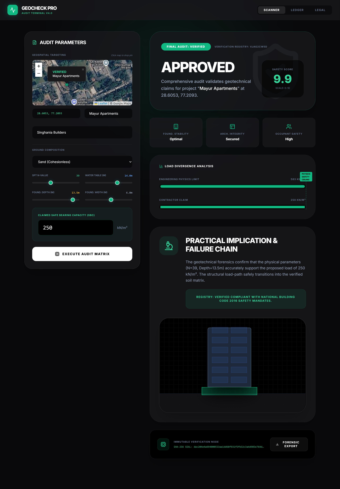

# GeoCheck 🌍 | AI Soil Report Authenticator

An AI-powered web application that detects fraudulent and manipulated soil investigation reports to ensure structural safety in construction.

## 📌 The Problem
Soil investigation reports are critical for foundational engineering, but they are often vulnerable to manipulation, copy-pasting from previous sites, or manual data tampering. Relying on fraudulent data can lead to catastrophic structural failures.

## 💡 The Solution
GeoCheck provides an interactive, browser-based dashboard that scans uploaded soil reports and cross-references the data. By leveraging cryptographic hashing, it identifies inconsistencies and flags potential fraud before construction begins.

## ⚙️ How It Works (Technical Mechanism)
- **Data Parsing:** The system extracts key metrics from the uploaded soil report.
- **SHA-256 Cryptographic Hashing:** To ensure data integrity, reports are processed using the SHA-256 algorithm. This guarantees that even a single altered character in the report generates a completely different hash, immediately flagging it as tampered.
- **AI Verification:** The interface cross-references the data patterns against known benchmarks to highlight anomalies.

## 🛠️ Tech Stack
- **Frontend UI:** HTML5, CSS3, JavaScript
- **Security Logic:** Cryptographic Hashing (SHA-256)
- **Hosting/Deployment:** Netlify

## 🚀 Quick Start
Since this is a client-side web application, no complex installation is required. 
1. Clone the repository: `git clone https://github.com/theanshdhyani/Geocheck-Project.git`
2. Open `index.html` in any modern web browser.
3. Or simply visit the [Live Demo](https://geocheckproject.netlify.app/).

## 🔮 Future Scope
- Integration with blockchain for immutable report storage.
- Expanded AI pattern recognition for specific regional soil profiles.
